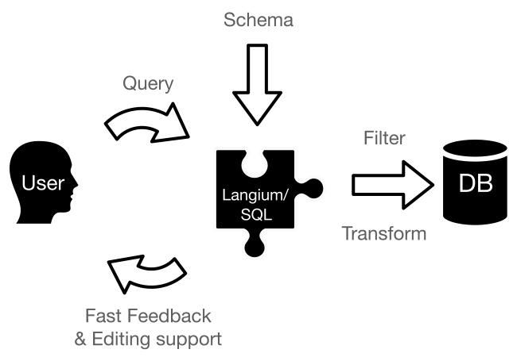

# Langium/SQL

This project provides a language server for SQL dialects.

## Features

* **Schema-driven**: Add a set of table definitions to spread out the world for your SELECT queries.
  The table definitions can be located in a different file of the same workspace. You can keep definitions and queries separated.
* **Code completion**: Press Ctrl + Space keys to trigger the completion directly. You will get suggestions for the current context.
* **Syntax highlighting**: to distinguish what are keywords, identifiers, numeric literals and for a better perception of the SQL syntax.
* **Symbol search**: Use Cmd or Ctrl + mouse click on a column name to find the definition of it or explore the places where a column is used.
* **Fast feedback** about contextual correctness: Whether referenced columns exist or types on certain operators are matching.
* **Super-set approach**: Any piece of any dialect that is missing can be added to the main grammar and be protected from other dialects using validations.
* **Highly customizable**: Any behavior or aspect that is missing for your specific use case can be easily overwritten.




## Demo

We prepared a showcase on the Langium project website. You can find it [here](https://langium.org/showcase/sql/).

The given schema describes an airport database. It contains tables for airports, airlines, flights, and passengers. The queries are written in the MySQL dialect.

## Getting started

### Installation

```sh
npm install langium-sql
```

or

```sh
yarn add langium-sql
```

### Learn more

Checkout the [announcing blog post](https://www.typefox.io/blog/langium-sql) or the [Langium documentation](https://github.com/langium/langium#documentation) to get familiar with the project structure.

### Usage and Examples

```
TODO
```

## License

[MIT](../../LICENSE)